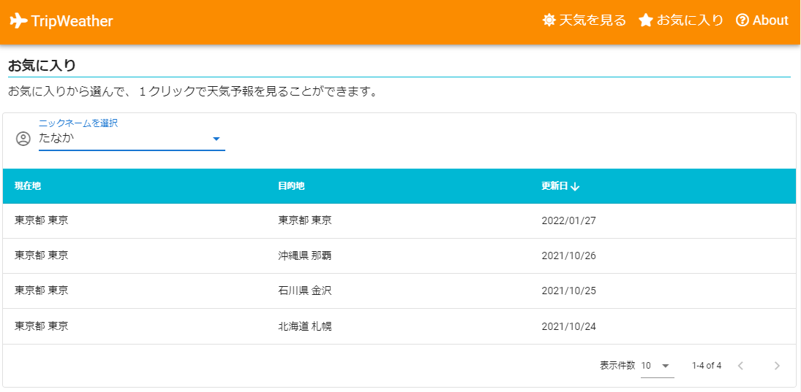
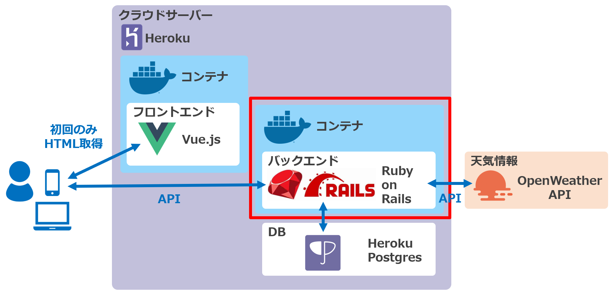

# TripWeather
旅行先のこの先一週間の天気予報を現在地と比較して見ることができるWebサイトです。

現在地・目的地をお気に入りに登録しておくことで、次回以降は簡単に天気予報を確認することができます。

レスポンシブ対応のため、スマホ/PCどちらからでも利用可能です。

 

## サイトURL
https://trip-weather-frontend.herokuapp.com/
 

## 構成図
このリポジトリは以下赤枠部分のコードを含みます。
 

関連するリポジトリは以下の3つです。
- フロントエンド（Vue.js）  
  https://github.com/yakitori99/trip-weather-frontend

- バックエンド①（Go+Echo版。機能はRails版と同様）  
  https://github.com/yakitori99/trip-weather-backend

- **バックエンド②（Rails版。このリポジトリ）**  
  https://github.com/yakitori99/trip-weather-backend-rails

## 主な使用技術（アプリケーション全体）
### フロントエンド
- Vue.js 2.6
  - Vuex (状態管理ライブラリ)
  - Vue Router (SPA構築用ルーティング制御ライブラリ)
  - Vuetify (UIライブラリ)
  - vue-toasted (トースト表示用ライブラリ)
- chart.js (グラフ表示)
- axios (非同期通信)
- nginx (Webサーバ)
- Font Awesome (アイコン)

### バックエンド①
- Go 1.16
  - Echo (Webフレームワーク)
  - GORM (ORMフレームワーク)
  - logrus (ログ出力用ライブラリ)
  - go-simplejson (jsonのパース用ライブラリ)
  - apitest (APIテスト用ライブラリ)

### バックエンド②
- Ruby 3.0 / Ruby on Rails 6.1
  - Puma (Web/アプリケーションサーバ)
  - Faraday (HTTP通信用ライブラリ)
  - parallel (並行処理用ライブラリ)

※バックエンド①と②は全く同じ機能です。学習のため、2つの言語でそれぞれ作成しました。

### インフラ
- Heroku
- Heroku Postgres
- Docker / docker-compose

### API
- OpenWeather API
 

## 機能一覧（アプリケーション全体）
- 天気表示機能
  - 現在地の昨日、今日の天気
  - 目的地の今日の天気、明日から1週間の天気予報
- お気に入り登録機能
- お気に入り一覧表示機能
  - ページネーション
  - ソート
- お気に入りから選んで天気を表示する機能
 

## API一覧（バックエンド：Rails）
|No.|アクセスURI|メソッド|概要|
|:----|:----|:----|:----|
|1|/prefs|GET|都道府県一覧を返す|
|2|/cities|GET|都市一覧を返す|
|3|/weather_from/:city_code|GET|都市コードを入力とし、その都市の昨日・今日の気温・天気情報を返す|
|4|/weather_to/:city_code|GET|都市コードを入力とし、その都市の今日から1週間の予想気温・天気情報を返す|
|5|/datetimes|GET|Webサーバの現在日時を元に、today-1 ～today+7の日時文字列を返す|
|6|/favorites|POST|お気に入り情報をfavoritesテーブルにINSERTする ※すでに登録済みの現在地・目的地のセットだった場合、INSERTは行わず、更新日時のUPDATEのみ行う|
|7|/favorites/by/:nickname|GET|ニックネームを入力とし、favoritesテーブルをニックネームで検索し、お気に入り情報を全件返す ※登録日時の降順でソート|
|8|/nicknames|GET|ニックネーム一覧を返す ※ニックネームの昇順でソート|
 

## 工夫したこと（バックエンド：Rails）
- 高速化のため、2つ以上のAPIを呼び出すときは並行処理とした
  - parallelというライブラリを利用
- テストコードを用いて、単体テスト・APIテストを自動化した
  - minitestを利用

## やっていないこと（バックエンド：Rails）
- ログイン機能はなし
  - 天気を見るだけのアプリでユーザ登録をさせたくないため
- WebAPIの機能として、基本的に入力値のチェックなし
  - 自作のフロントエンドからのみ呼び出す処理であり、想定外の値が来ることはないため
  - ただし、念のため、登録系のAPIのみ不整合データが登録できないようなチェック処理あり